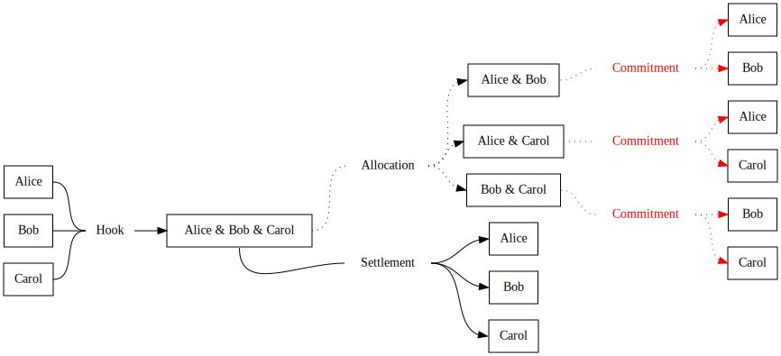
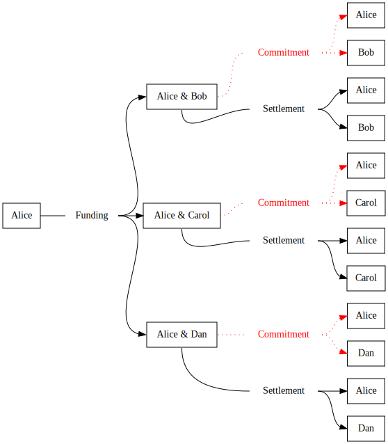

# Single-use channel factories

Inspired by [Scalable Funding of Bitcoin MicropaymentChannel Networks](https://nakamotoinstitute.org/static/docs/scalable-funding-of-bitcoin-micropayment-channel-networks.pdf) but simpler.

Channel factories are more efficient only when everyone cooperates fully.
If it is closed forcefully because of someone being unavailable for too long or of incompatibilities between implementations then it becomes more expensive than traditional channels.
Alice should only consider opening a channel factory with Bob and Carol if she considers them reliable peers.

## Architecture

Transactions in red are standard Lightning channel commitments (they're actually pairs of transactions).
All the other transactions have simple multisig n of n outputs.

If everything goes well, the dotted transactions are never published to the blockchain.

## Benefits

Save on transaction fees.
If the factory has many participants that want to open a superlinear number of channels between them, the fee per channel can get arbitrarily low.

# Multiple-use channel factories

Multiple-use channel factories require making the allocation transaction revocable which increases the costs if someone stops cooperating.
If the traffic between the nodes is not balanced, source nodes will see their funds drained and sink nodes will saturate all their channels and no re-allocation can change that without adding new funds to the factory (which would require an onchain transaction).
In practice I don't think that the added complexity of a multiple-use channel factory is worth it.

# Batched channels

An even simpler design that is more efficient than standard channel opening even when nodes stop cooperating after the initial stage.
This is well-suited for opening channels to mobile wallets.

## Architecture

The other participants might want to add funds too but if they are active routing nodes, then the channel factory is probably a better option.

## Benefits

Save on transaction fees.
The cost of the funding input is divided by the number of channels opened simultaneously.
The costs of the funding outputs and of the closing stay the same.
These saving are guaranteed and do not depend on future cooperation from the other nodes.
